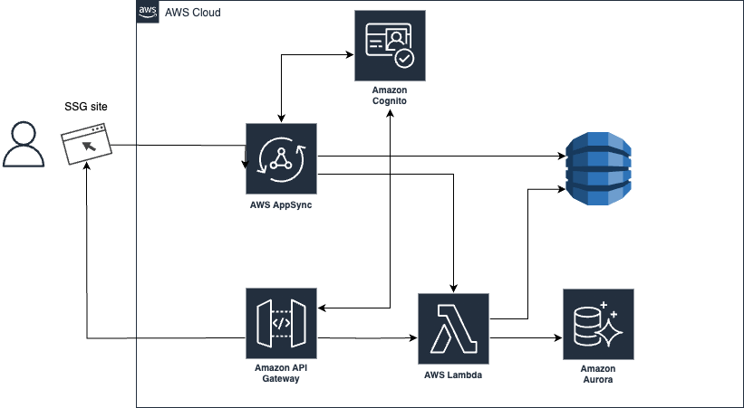

# Overview

Fully serverless web architecture on AWS with Prisma and GraphQL.

## Features

This template provides GraphQL and REST API using AWS serveless services.

- AppSync and API gateway support

- DynamoDB and RDS support

- Prisma support for schema management

- Cognito authentication support

Infra/Backen/Frontend code is written by typescript, and deploy and debelop by AWS CDK and Amplify.

## Tech Stack

- [x] Prisma

Prisma is a performant open-source GraphQL ORM-like layer doing the heavy lifting in your GraphQL server.

[Prisma](https://www.prisma.io/)


- [x] Prisma Appsync

Prisma AppSync is a library that makes it easy to implement GraphQL servers with Prisma.

[Prisma with AWS AppSync](https://github.com/maoosi/prisma-appsync)

- [x] GraphQL

GraphQL is a query language for your API, and a server-side runtime for executing queries by using a type system you define for your data.

- [x] AWS AppSync

AWS AppSync is a managed GraphQL service that makes it easy to develop, secure, and scale GraphQL APIs.

# Architecture



## Access Flow

1. Appsync -> Lambda -> RDS

User and UserInfo at this demo

2. Appsync -> DynamoDB

User History at this demo

3. Appsync -> Lambda -> RDS and DynamoDB

Transction History at this demo

4. API Gateway -> Lambda -> RDS or DynamoDB or (RDS and DynamoDB)

TBD


## Directory Structure

```bash
├── backend
│   ├── cdk # for AWS CDK
│   ├── cdk.json # for AWS CDK
│   ├── codegen.yml # for Prisma codegen
│   ├── docker # for local development
│   ├── docker-compose.yaml # for local development
│   ├── jest.config.js # for jest
│   ├── lambda # for lambda functions
│   ├── package.json # for npm
│   ├── prisma # for Prisma
│   ├── appsync # for GraphQL Defenition and Resolver
│   ├── graphsqlserver # for local development(GraphQL server), the target is prisma/generate/schema.gql
│   └── test # for jest
```

# Getting Started

## Local Enviroment

1. Install dependencies

```bash
cd backend
npm install
```

2. Run docker

```bash
docker-compose up -d
```

2. Generate prisma client

```bash
yarn generate # for generate prisma client, create GraphQL client to prisma/generate
yarn codegen # for generate typescript from GraphQL schema
npx prisma migrate dev --name init # for create migration file, create sql and migrate it to DB to prisma/migration
cp prisma/generated/migration/[target_date]/migration.sql prisma/migration.sql # for migration target sql. if you create with schema, please add
```

3. Test by jest

```bash
npx jest -- user-controller.test.ts
```

4. Test by GraphQL Playground

```bash
yarn run dev
```

## Deploy to AWS

1. Install dependencies

```bash
cd backend
npm install
```

2. Deploy to AWS

```bash
# edit cdk.json, change app "name" and "schema" to your name
yarn cdk deploy --all env=[your name]
```

3. Create schema

```bash
aws lambda list-functions | grep "createschema" # Please check function-name you deployed to AWS which include "createschema"
aws lambda invoke --function-name <function-name> output.json 
```

4. Insert data to RDS via Lambda

```bash
aws lambda list-functions | grep "insertuser" # Please check function-name you deployed to AWS which include "insert-user"
aws lambda invoke --function-name <function-name>  output.json
```

5. Insert data to RDS via GraphQL API

Please open Appsync and run GraphQL on the editor.


6. Insert data to Dynamo

```bash
aws dynamodb list-tables | grep "TransactionHistory" # Please check table-name you deployed to AWS which include "transaction"
aws dynamodb put-item \
    --table-name {table-name} \
    --item '{
        "id": {
            "S": "1"
        },
        "completed": {
            "BOOL": false
        },
        "createdAt": {
            "N": "1682484212"
        },
        "title": {
            "S": "aaaa"
        }
    }'
```


7. Check the data via Appsync and run GraphQL on the editor.


x. Delete all resources

```bash
yarn cdk destroy --all -c env={EnvName}
```

# Customize

## Apprync -> Lambda -> RDS

1. Edit prisma/schema.prisma

2. Generate prisma client

```bash
yarn generate
yarn codegen
# rm -rf prisma/migrations
npx prisma migrate dev --name init
```

3. Copy prisma/migrations/[target_date]/migration.sql to prisma/migration.sql

4. Test and Deploy to AWS

## Appsync -> Lambda -> DynamoDB

1. Create new GraphQL definetion under appsync/

2. Generate typescript 

```bash
yarn generate # for generate prisma client, create GraphQL client to prisma/generate
yarn codegen # for generate typescript from GraphQL schema
```

3. Create new lambda handler

Please refer to lambda/hander/get-transactionhistory-hander.ts

4. Create DynamoDB table and Lambda function

Please refer to

- cdk/lib/dynamodb-stack
- cdk/lib/lambda-stack
- bin/app.ts

## Appsync -> Dynamo

1. Download schema and resolver from Appsync

Define Appsync schema and resolver is troblesome,
So I recommend to use Appsync to create schema and resolver and download it.

```bash
yarn donwnloadSchema {appId} {schemaName} # appId is Appsync id, schemaName is schema name
```

# Frontend

1. Install dependencies

```bash
cd frontend
npm install
```

2. Setting amplify

Please update src/aws-exports.js to your own Cognito Information

```bash
amplify init
amplify add codegen --apiId [your graphql api id]
# Please update src/aws-exports.js to your own Cognito Information
# const awsmobile = {
#    "aws_project_region": "", // Your region
#    "aws_cognito_identity_pool_id": "", // Cognito Identity Pool ID
#    "aws_cognito_region": "",  // Your region
#    "aws_user_pools_id": "", // Cognito User Pool ID
#    "aws_user_pools_web_client_id": ""  // Cognito User Pool ID
# };
```

- [x] Update schema

```bash
amplify codegen
```

## Prerequisites

- [Node.js](https://nodejs.org/en/download/) (v10.0.0 or higher)

- [AWS CLI](https://docs.aws.amazon.com/cli/latest/userguide/cli-chap-install.html) (v1.16.0 or higher)

- [Docker](https://docs.docker.com/get-docker/) (v19.03.0 or higher)


## Installation

# Reference
1. [Prisma](https://www.prisma.io/)
2. [Prisma with AWS AppSync](https://github.com/maoosi/prisma-appsync)
3. [AWS CDK Pipeline × Prisma でRDSに接続するLambdaを実装する](https://zenn.dev/taroman_zenn/articles/da11f27537c37d)